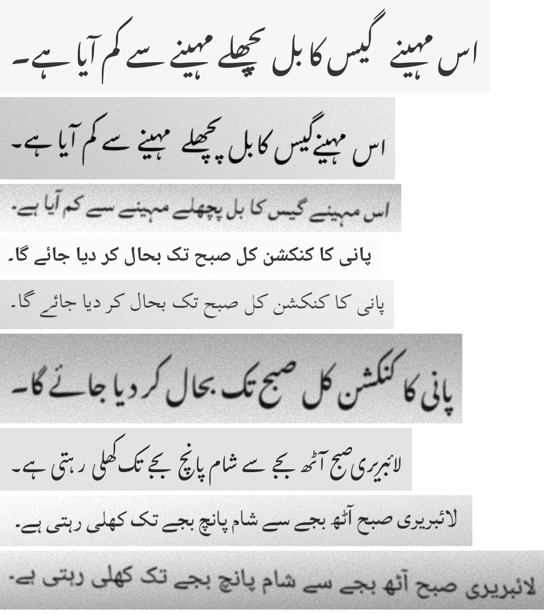

# UrduLens

[](https://github.com/abdullahbinmasood702/urdulens/actions/workflows/ci.yml)


**An open, reproducible benchmark for Urdu OCR: compare engines on the same lines, see where each one fails, and read Urdu from your own photos.**

Built by [Abdullah Bin Masood](https://www.linkedin.com/in/abdullahbinmasood702) · [Code with ABM](https://codewithabm.vercel.app)

<p align="center"></p>

## Why this exists

Urdu is written in cursive Nastaliq, and reading it from an image is still hard. Public Urdu OCR projects report very
different error rates, each on its own data, so nobody can tell which approach is actually better:

* one fine-tuned TrOCR model reports a [Tesseract word-recovery rate of 2.1%](https://huggingface.co/qandeelasim13/urdu-ocr-trocr-si26) on its own data,
* [another TrOCR model](https://huggingface.co/mohammadalihumayun/trocr-ur) reports a CER of about 25% on its validation set,
* a [vision-language model](https://huggingface.co/oddadmix/Qaari-0.1-Urdu-OCR-VL-2B-Instruct) reports a CER of about 3% on its evaluation set.

Those numbers are self-reported on different, mostly undisclosed test sets, so they cannot be compared (checked September 2026; I could not find an open
head-to-head benchmark, though my search was not exhaustive). UrduLens is a small, transparent attempt at a common yardstick: a frozen test set, a
documented scoring method, engines behind one interface, a weekly automated run, and a public dashboard.

## Results

Latest run on the synthetic set (350 lines: 20 sentences x 5 fonts x 3 image-quality levels, plus 50 lines of numbers, dates and prices; lower is better). Auto-updated by the weekly workflow.

<!-- LEADERBOARD:START -->
**350 lines, dataset: all**

| Engine | Lines | CER | WER | Exact lines | Speed |
|---|---|---|---|---|---|
| easyocr | 350 | 13.6% | 49.0% | 9.4% | 327 ms |
| tesseract | 350 | 39.2% | 57.2% | 32.6% | 46 ms |

**CER by style**

| Engine | nastaliq | naskh |
|---|---|---|
| easyocr | 20.9% | 8.7% |
| tesseract | 49.5% | 32.3% |

**CER by degradation**

| Engine | clean | mild | heavy |
|---|---|---|---|
| easyocr | 10.6% | 14.7% | 14.8% |
| tesseract | 15.7% | 31.8% | 73.7% |
<!-- LEADERBOARD:END -->

Measured on a single-core CPU machine (2026-09-19): Tesseract 5.3.4 with the `tessdata_fast` `urd` model, EasyOCR 1.7.2. Speed is not comparable across machines.

**What the first run shows** (all from `results/latest_scores.csv`):

* EasyOCR is far more accurate than Tesseract on this set (CER 13.6% vs 39.2%), but a large part of its remaining error is **word spacing and punctuation**:
  ignoring spaces and punctuation its CER drops to 7.8%, and it merged words in 42% of lines. That is why its WER (49%) is so much higher than its CER.
* Tesseract returned **nothing at all** for 61% of the heavily degraded lines. It got 32.6% of all lines exactly right (EasyOCR: 9.4%), but every one of those was in a Naskh font; it never got a Nastaliq line fully right.
* Both engines do much better on **Naskh** fonts than on **Nastaliq** (EasyOCR 8.7% vs 20.9%; Tesseract 32.3% vs 49.5%). Nastaliq is what most Pakistani print uses.
* Lines of numbers, dates and prices are harder than sentences for both engines.

**Read this before quoting any number:** these are *synthetic* images (rendered text with simulated blur, noise and JPEG damage), so they measure engines against each other
under controlled conditions. They are **not** real-world accuracy on phone photos of newspapers. The real-image test set is the next step (`docs/LABELING.md`), and the
scoring method and its limits are documented in [`docs/METHODOLOGY.md`](docs/METHODOLOGY.md).

## Quick start

```bash
git clone https://github.com/abdullahbinmasood702/urdulens.git
cd urdulens
python -m venv .venv && source .venv/bin/activate      # Windows: .venv\Scripts\activate
pip install -e ".[db,app,dev]"
# Tesseract with Urdu data (Ubuntu: sudo apt install tesseract-ocr tesseract-ocr-urd; Windows: see docs/GUIDE.md)

urdulens benchmark --engines tesseract          # score Tesseract on the frozen benchmark (about 1 minute)
python -m streamlit run apps/dashboard.py       # open the leaderboard dashboard
python -m streamlit run apps/reader.py          # read Urdu from a photo
```

Add EasyOCR with `pip install easyocr`. The full step-by-step guide (Windows, Neon database, GitHub Actions, Render, Hugging Face Space) is in [`docs/GUIDE.md`](docs/GUIDE.md).

## How it works

```
                          frozen benchmark (350 synthetic lines + your real lines)
                                              |
        Tesseract | EasyOCR | PaddleOCR* | UrduLens CRNN   <- one OCREngine interface
                                              |
                    scoring (normalise -> CER / WER)  --> results/leaderboard.md --> README
                                              |
             GitHub Actions (weekly) --> Neon Postgres --> Streamlit dashboard (Render)
                                                       \--> Reader app (Hugging Face Space)
```
\* experimental wrapper, not verified by the author.

| Piece | Tool | Cost |
|---|---|---|
| Scheduler and CI | GitHub Actions | free |
| Results database | Neon Postgres (SQLite locally) | free tier |
| Dashboard | Streamlit on Render | free tier |
| Reader app | Streamlit on a Hugging Face Space | free tier |
| Model training | Kaggle or Colab GPU | free quota |
| Experiment tracking | Weights & Biases (optional) | free for personal use |
| Fonts | SIL OFL fonts bundled in `fonts/` | free |

## What is in the repo

| Path | What |
|---|---|
| `urdulens/` | the package: synthetic data, augmentation, scoring, engines, model, training, storage, CLI |
| `data/corpus/` | 165 original everyday Urdu sentences (CC0) with a hash-based train/val/test split |
| `data/benchmark/` | the frozen synthetic benchmark (images + manifest); your real set goes in `real/` |
| `apps/` | `dashboard.py` (leaderboard), `reader.py` (photo to text), `labeler.py` (label real lines) |
| `train/kaggle_train.ipynb` | one-click GPU training notebook |
| `.github/workflows/` | CI (lint + tests) and the weekly benchmark |
| `docs/` | guide, methodology, labeling, training, adding an engine, launch kit |

Commands: `urdulens benchmark | build-benchmark | prepare-real | train | init-db | update-readme | space | card | preview`.

## What has and has not been tested

| Part | Status |
|---|---|
| Scoring, normalisation, text-order (bidi) conversion, corpus split, benchmark construction | unit-tested (65 tests; 60 run without PyTorch) |
| Tesseract and EasyOCR engines, full benchmark run, SQLite storage, report generation | run end to end on Linux; numbers above |
| Streamlit apps | smoke-tested with Streamlit's test runner (start without errors, empty and populated states) |
| CRNN model | forward/backward shapes and checkpoint tested; overfits a tiny batch to 0% CER; a 6-step training run completes. **No full training run yet** |
| GitHub Actions workflows, Neon, Render, Hugging Face Space, Kaggle notebook, PaddleOCR wrapper | written to the platforms' documented behaviour but **not run** by the author; expect to fix small things on first run |
| Windows | commands follow the same steps as the Linux run; Tesseract path auto-detect is included but was not run on Windows |

## Roadmap

- [ ] Add 100-200 real labeled lines and publish the first real-image results
- [ ] Train the CRNN on a GPU and report its real-set error honestly
- [ ] Full-page evaluation (line detection and reading order)
- [ ] More engines (vision-language OCR models, PaddleOCR verification)
- [ ] Handwriting track

## Contributing

Engines, real test lines and Urdu sentences are all welcome: see [CONTRIBUTING.md](CONTRIBUTING.md).

## License

Code: MIT. Sentence corpus: CC0. Fonts: SIL Open Font License 1.1 (see `fonts/`).
